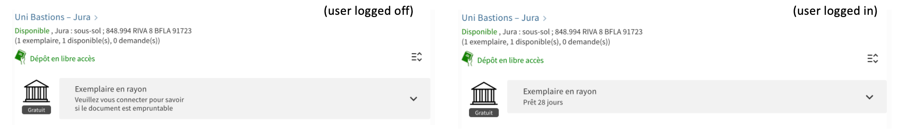

# Display custom message for non-circulating items

Displayed loan policies in Primo are currently 
[dependent on fulfillment terms of use](https://knowledge.exlibrisgroup.com/Alma/Knowledge_Articles/Loanable%22_Policy_information_in_Primo_GetIt_tab_-_how_is_it_calculated%3F),
which are only available when users are logged in.
Consequently, loan policies are often mistakenly displayed for users that are not logged in. Instead, it would be beneficial for the loan
policy display to be controlled by item or location policies. 
This is [a long-expected and heavily requested feature](https://ideas.exlibrisgroup.com/forums/308176-primo/suggestions/36317461-display-item-policy-in-item-record)
and ExLibris has finally developped this feature and the item policy can be displayed after the august 2023 release: https://knowledge.exlibrisgroup.com/Primo/Release_Notes/002Primo_VE/2023/010Primo_VE_2023_Release_Notes?mon=202308BASE#Features 

Until this enhancement was released, many SLSP members have disabled the display of loan policies altogether to remove loanable items to be
mistakenly labeled as unavailable, however this also means that items that are actually not available are not flagged as such.

The item policy display is currently being tested at the UNIGE, but the proposed labels need to be improved to avoid confusion. A solution for modifying this display is [available in the VU3 of our sandbox](https://github.com/dis-unige/swisscovery-vu3/tree/main/js/slsp-location-items-after/unige-loan-policy-label-fix), but until it is implemented, this module provide a temporary solution to this issue:

 * If the user is not logged in: the item display is modified to show a general message inviting the user to log in in order to see whether an item is loanable or not
 * If the user is logged in and the document is loanable: the display is left as-is, the loan conditions displayed are OK
 * If the user is logged in and the document is not loanable: the item policy displayed is empty and we display the label 'unige_non_circulating'



Binding directive: `slsp-location-items-after`

## Usage

### Enable the module

To enable this module, copy it inside your view's Javascript folder, import it into your `main.js` and add `unigeNonCirculatingLabel` to the list of 
declared modules.

Following our network practice, at UNIGE we try to keep this folder organized by the directives to which modules are bound, but you don't have to.
Accordingly, enabling modules is done in a two-step process:

In `slsp-location-items-after/index.js`:

```JavaScript
require('./unige-non-circulating-label/unige-non-circulating-label.module.js')
module.exports = 'unigeNonCirculatingLabel'

```

In `main.js`:

```JavaScript
import './slsp-location-items-after';

var app = angular.module('viewCustom', [(...), 'unigeNonCirculatingLabel']);

```

Alternatively, you can also directly require the module file in your `main.js` (adjust the path to the module accordingly):

```JavaScript
require('./slsp-location-items-after/unige-non-circulating-label/unige-non-circulating-label.module.js')

var app = angular.module('viewCustom', [(...), 'unigeNonCirculatingLabel']);

```

### Dependencies

This module requires the following label to be defined in order to properly display texts in the correct language:

```
ViewIt Labels: c.uresolver.getit2.item_list.non_circulating
EN : NOT_DEFINED
FR : NOT_DEFINED
DE : NOT_DEFINED
IT : NOT_DEFINED

ViewIt Labels: c.uresolver.getit2.item_list.circulating
EN : NOT_DEFINED
FR : NOT_DEFINED
DE : NOT_DEFINED
IT : NOT_DEFINED

ViewIt Labels: nui.message.itemlogin
EN : Please login to see if the<br/> document is available for loan
FR : Veuillez vous connecter pour savoir<br/> si le document est empruntable
DE : Bitte loggen Sie sich ein,<br/> um zu sehen ob das Dokument ausleihbar ist
IT : Effettuare il login per sapere<br/> se il documento è disponibile per il prestito

ViewIt Labels: unige_non_circulating
EN : Not loanable
FR : Prêt exclu
DE : Nicht ausleihbar
IT : Prestito escluso

```

## Known issues

No known issues at this time.

## Changelog

* 2023-09-22 [PI] Added the display of unige_non_circulating label in case of user logged in and document not loanable.
* 2023-06-14 [TG] Added documentation.
* 2023-05-12 Pushed to production
* 2023-04-27 [TG] Released module for internal testing.
